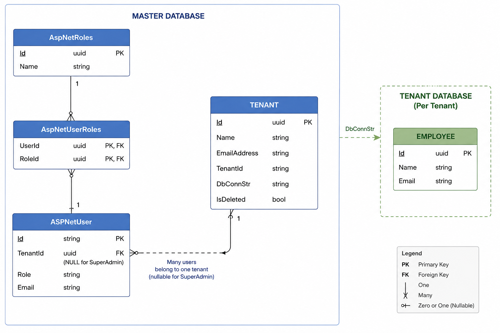

# Architectural Overview

This system is built using Clean Architecture with CQRS and a database-per-tenant multi-tenancy model using ASP.NET Core 8, PostgreSQL, Identity, and JWT authentication.


### Key Highlights
- Clean Architecture with strict separation of concerns
- CQRS + MediatR for scalable business logic
- JWT-based authentication with RBAC
- Fully isolated tenant databases (PostgreSQL)
- Dockerized setup

---

## Architecture

```
Client
↓
API Layer (Controllers + Middleware)
↓
Application Layer (CQRS + Business Logic)
↓
Domain Layer (Entities)
↓
Infrastructure Layer (EF Core + DB + Identity)
```

---

### Tenant Architecture Flow

```
User Login
↓
Identity Validation
↓
Tenant Resolution (Master DB)
↓
Fetch Tenant Connection String
↓
Create Tenant DbContext
↓
Execute Tenant Operations
```

---

## Authentication & Authorization

### Authentication Flow

```
Login Request
↓
ASP.NET Identity Validation
↓
JWT Generation
↓
Return Token to Client
````

### JWT Payload

```json
{
  "sub": "userId",
  "email": "user@example.com",
  "tenantId": "tenant-id",
  "role": "Admin",
  "exp": 1234567890
}
````

---

## Database Design



### Master Database

Stores global system data:

* Tenants (Id(Pk), FullName, EmailAddress, DbConnStr, TenantId(Unique))
* ASP.NET Identity Users (Emai, Role, TenantId(Fk->Tenant.Id))
* Roles

---

### Tenant Database

Each tenant has its own DB:
* Employee (Id, FullName, EmailAddress)

---

## Key Design Patterns

* **Clean Architecture** → Separation of concerns
* **CQRS** → Split read/write operations
* **Repository Pattern** → Data abstraction
* **Unit of Work** → Transaction handling
* **Factory Pattern** → Tenant DbContext creation
* **Dependency Injection** → Loose coupling

---

### Standard HTTP Responses

* 200 → Success
* 201 → Created
* 400 → Validation error
* 401 → Unauthorized
* 403 → Forbidden
* 404 → Not found
* 500 → Server error

---

## Tech Stack

* ASP.NET Core 8
* PostgreSQL
* Entity Framework Core
* MediatR
* FluentValidation
* ASP.NET Identity
* JWT Authentication
* Docker

---